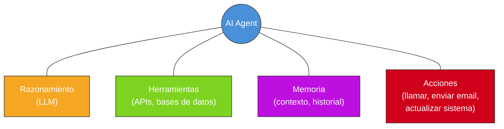
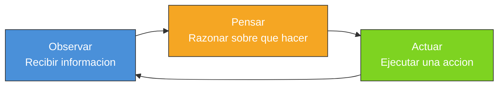
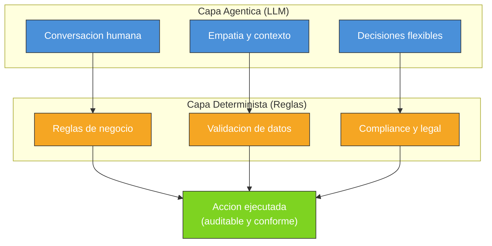
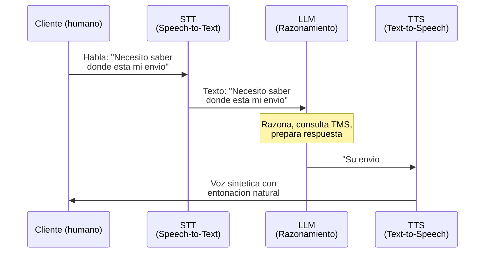

# AI Agents y Voice AI — Lo que necesitas saber

Este documento es un crash course de ~20 minutos sobre las dos tecnologías core que vende [HappyRobot](../empresa/producto.md): **agentes de IA** y **voice AI**. Escrito para una ejecutiva de negocio, no para ingenieros. Los conceptos técnicos se explican con analogías de negocio.

---

## 1. Chatbot vs Agente vs Workflow

Tres conceptos que la gente confunde constantemente. La diferencia importa porque HappyRobot vende **agentes**, no chatbots ni workflows.

| | Chatbot | Workflow / RPA | AI Agent |
|---|---------|---------------|----------|
| **Analogía** | Recepcionista con un FAQ | Cadena de montaje | Empleado senior con criterio |
| **Qué hace** | Responde preguntas predefinidas | Ejecuta pasos fijos en orden | Razona, decide, actúa, aprende |
| **Flexibilidad** | Baja: si la pregunta no encaja, falla | Nula: si un paso falla, todo para | Alta: se adapta a lo inesperado |
| **Usa herramientas** | No | Solo las del script | Si, elige cuales usar |
| **Toma decisiones** | No | No (solo sigue reglas) | Si, dentro de guardrails |
| **Ejemplo** | "Horario de apertura: 9-18h" | "Si pedido > EUR 500 -> aprobacion manager" | Negocia un plan de pago con un deudor, actualiza el ERP, y envia confirmacion por email |

**Lo que HappyRobot construye son agentes.** No chatbots que responden FAQs. No scripts rigidos que fallan cuando algo cambia. Agentes que razonan, usan herramientas, y ejecutan acciones reales en sistemas empresariales.

---

## 2. Anatomia de un AI Agent

Un agente tiene cuatro pilares. Piensa en un empleado nuevo que llega a tu equipo:

- **Razonamiento (LLM)** = su cerebro, su capacidad de entender y pensar
- **Herramientas** = acceso a los sistemas de la empresa (CRM, ERP, email...)
- **Memoria** = lo que recuerda de interacciones anteriores
- **Acciones** = lo que puede hacer en el mundo real



**Analogia Amazon:** Piensa en un vendor manager junior que acaba de llegar. Le das un cerebro (formacion), acceso a herramientas (Vendor Central, email, datos de ventas), memoria (notas de reuniones previas con el proveedor), y capacidad de actuar (negociar, crear POs, ajustar pricing). Un AI agent es exactamente eso, pero digital y disponible 24/7.

---

## 3. El loop agentico

Un agente no ejecuta un script lineal. Opera en un **loop continuo**: observa, piensa, actua, y vuelve a observar el resultado. Exactamente como tu resuelves un problema en el trabajo.



### Ejemplo real: llamada de cobro (collections)

Este es un caso de uso real de HappyRobot con **119x de ROI**. Veamos como el agente maneja una llamada de cobros paso a paso:

| Paso | Observar | Pensar | Actuar |
|------|----------|--------|--------|
| 1 | Factura #4521 vencida hace 15 dias, EUR 8,200 | Debo contactar al cliente para cobrar | Llama al telefono del cliente |
| 2 | El cliente contesta y dice "si, lo se, tuve un problema de cash flow" | Circunstancia atenuante, pero necesito cobrar. Puedo ofrecer plan de pago segun las reglas | Ofrece plan de pago en 2 cuotas (dentro de guidelines) |
| 3 | El cliente acepta pagar 50% ahora y 50% en 15 dias | Acuerdo dentro de parametros. Debo registrarlo y confirmar | Actualiza el ERP con el plan, envia email de confirmacion |
| 4 | Confirmacion enviada correctamente | Tarea completada con exito | Cierra el caso, programa follow-up en 15 dias |

En cada paso, el agente **observa** nueva informacion, **piensa** que hacer, y **actua**. No sigue un script rigido: si el cliente hubiera dicho "esa factura ya la pague", el agente habria verificado en el sistema y ajustado su respuesta.

---

## 4. Tool use / Function calling

Aqui esta la magia que diferencia a un agente de un chatbot. Un agente puede **usar herramientas reales**: consultar bases de datos, llamar a APIs, enviar emails, actualizar sistemas.

**Como funciona (simplificado):**

1. El LLM (cerebro) recibe informacion del usuario
2. Decide: "necesito consultar el TMS para ver el estado del envio"
3. Llama a la herramienta (API del TMS) con los parametros correctos
4. Recibe el resultado: "Envio #7832: en transito, ETA manana 14:00"
5. Usa esa informacion para continuar la conversacion

**Analogia:** Es como un empleado que esta al telefono con un cliente y, mientras habla, abre otra pantalla para consultar el sistema. La diferencia es que el agente hace esto en milisegundos.

!!! tip "Por que importa para la entrevista"
    HappyRobot tiene **integraciones nativas** con sistemas logisticos (Transport Pro, McLeod, DAT, Truckstop, Highway, Samsara) y puede conectar con cualquier sistema via API, webhooks, o incluso **browser agents** que navegan webs sin API. Esto es lo que convierte a un "chatbot inteligente" en un agente que realmente trabaja.

### Ejemplo: agente gestionando un problema de envio

```
Cliente llama: "Donde esta mi envio #7832?"
    -> Agente consulta TMS: envio en transito, ETA manana 14:00
    -> Agente responde al cliente con el status
    -> Cliente: "Necesito que llegue hoy, es urgente"
    -> Agente consulta opciones de ruta alternativa en el sistema
    -> Agente verifica costes adicionales contra reglas de negocio
    -> Agente ofrece opcion de envio express con coste adicional
    -> Cliente acepta
    -> Agente actualiza el envio en el ERP, notifica al carrier por email
```

Todo esto ocurre en **una sola llamada**, sin intervencion humana.

---

## 5. Orquestacion

En la realidad empresarial, un solo agente no basta. Necesitas **equipos de agentes** que trabajan juntos, igual que en una empresa real.

| Modelo | Que es | Cuando usarlo | Ejemplo |
|--------|--------|---------------|---------|
| **Agente unico** | Un agente hace todo | Tareas simples y autocontenidas | Confirmar citas por telefono |
| **Multi-agente** | Varios agentes coordinados | Procesos complejos con especialidades | Uno negocia por telefono, otro actualiza sistemas, otro envia confirmaciones |
| **Human-in-the-loop** | Agentes + humanos | Decisiones criticas o excepciones | Agente escala a un humano cuando el importe supera EUR 50K |

HappyRobot llama a esto **workforce orchestration**: multiples AI Workers con **contexto compartido**. No son agentes aislados; comparten memoria, datos, y conocimiento del cliente.

**Analogia Uber:** Piensa en el operations center de una ciudad. Tienes a alguien gestionando supply, alguien gestionando demand, alguien en regulacion. No trabajan en silos: comparten datos en tiempo real. Los AI Workers de HappyRobot funcionan igual, pero con agentes digitales.

!!! info "Shared context"
    La memoria compartida es un diferenciador. Si un AI Worker habla con un carrier por telefono y otro le envia un email al dia siguiente, el segundo **sabe lo que se hablo** en la llamada. No hay "perdona, no tengo constancia de su llamada anterior" -- el clasico dolor de cabeza del customer service.

---

## 6. El diferenciador HappyRobot: Agéntico + Determinista

Esta es la seccion mas importante. Es lo que hace a HappyRobot diferente de todos los demas.

### El problema de los dos extremos

| Extremo | Que es | Problema |
|---------|--------|----------|
| **Pure LLM / Solo agéntico** | Dejas que la IA razone libremente | Impredecible. Puede inventar descuentos, dar informacion incorrecta, saltarse compliance. Inaceptable en enterprise. |
| **Pure RPA / Solo determinista** | Scripts rigidos tipo "si X, entonces Y" | Fragil. Si el cliente dice algo inesperado, el sistema se rompe. No puede manejar conversaciones reales. |

### La solucion hibrida de HappyRobot

HappyRobot combina las dos capas: el LLM maneja la **conversacion humana** (impredecible, con matices, emocional), y una capa determinista **enforces las reglas de negocio** (no negociables, auditables, predecibles).



### Ejemplo concreto: llamada de cobro

| Situacion | Capa agentica hace... | Capa determinista asegura... |
|-----------|----------------------|------------------------------|
| Cliente dice "no puedo pagar, tuve una emergencia medica" | Responde con empatia, ajusta el tono | Los planes de pago cumplen los guidelines financieros |
| Cliente pide un descuento | Evalua si tiene sentido negociar | El descuento no excede el % maximo autorizado |
| Hay que leer disclosures legales | Identifica el momento adecuado | El texto legal se lee **verbatim**, sin cambios |
| Cliente da datos de pago | Guia la conversacion naturalmente | Los datos se validan y registran correctamente en el sistema |

!!! warning "Por que esto importa en enterprise"
    Una empresa como DHL no puede permitirse que un agente de IA invente un precio o se salte un requisito legal. Tampoco puede usar un script rigido para manejar millones de llamadas con situaciones imprevisibles. La combinacion hibrida resuelve ambos problemas. Es la razon por la que 8 de los 10 mayores freight brokers de EEUU usan HappyRobot [B: HR-UPSTARTS].

Ver: [Producto HappyRobot](../empresa/producto.md)

---

## 7. Voice AI: el canal, no el producto

HappyRobot lo dice explicitamente: **"We are NOT a voice AI platform."** La voz es un **canal** entre muchos, como el email o el chat. Pero es el canal mas dificil tecnicamente y el mas critico para operaciones enterprise (en logistica, el telefono sigue siendo rey).

### Como funciona una llamada de voz con IA



**El pipeline:** Voz humana -> Texto (STT) -> Razonamiento (LLM) -> Texto de respuesta -> Voz sintetica (TTS) -> Humano escucha.

### Conceptos clave que debes conocer

| Concepto | Que es | Por que importa |
|----------|--------|-----------------|
| **Latencia** | Tiempo entre que el humano termina de hablar y la IA responde | Si tarda mas de ~800ms, la conversacion se siente rara. Como hablar con alguien con lag en una videollamada. |
| **VAD** (Voice Activity Detection) | Detectar cuando alguien esta hablando vs silencio vs ruido de fondo | Sin buen VAD, la IA interrumpe o no sabe cuando responder. Critico en entornos ruidosos (almacenes, camiones). |
| **EOT** (End-of-Turn Detection) | Detectar cuando alguien **termino** de hablar (no solo hizo una pausa) | "Quiero el envio... (pausa)... el numero 7832" -- una pausa no es el final. Esto es sorprendentemente dificil. |
| **STT** (Speech-to-Text) | Convertir voz en texto | Necesita ser rapido Y preciso. Nombres propios, numeros de referencia, acentos... |
| **TTS** (Text-to-Speech) | Convertir texto en voz | No basta con ser comprensible; tiene que sonar **natural**. Entonacion, ritmo, enfasis. |

!!! tip "Diferenciador tecnico de HappyRobot"
    HappyRobot tiene **modelos propietarios** para TTS, VAD, y EOT detection. No usan servicios de terceros para estos componentes criticos. Esto les da control total sobre la latencia y la calidad de la experiencia conversacional. Tambien les da margen competitivo: la mayoria de competidores dependen de APIs externas (Deepgram, ElevenLabs, etc.) que no pueden optimizar.

### Por que la voz es el killer channel en enterprise ops

1. **El telefono sigue siendo como se hace negocio** en logistica, cobros, recruiting, customer service
2. **Es el canal mas rico**: tono, urgencia, emociones -- informacion que el email no captura
3. **Es inmediato**: no hay espera de respuesta como en email
4. **Escala brutal**: DHL procesa **millones de minutos de voz** anuales con HappyRobot [A: HR-DHL]; [Job&Talent](../clientes/job-and-talent.md) ha hecho **1M+ entrevistas por IA** [B: HR-BLOG-JT]
5. **Es el mas dificil**: si dominas voz, el resto de canales (email, chat, SMS) son mas faciles

---

## 8. Mas alla de voz

HappyRobot no es solo telefono. Un mismo AI Worker puede operar **across canales**, eligiendo el mas adecuado para cada situacion:

| Canal | Uso tipico | Ejemplo real |
|-------|-----------|--------------|
| **Telefono** | Negociacion, urgencias, interacciones complejas | Llamada de cobro, booking de carga |
| **Email** | Comunicacion formal, documentacion, follow-ups | DHL: cientos de miles de emails anuales |
| **SMS / WhatsApp** | Confirmaciones rapidas, recordatorios | "Su envio llega manana 14:00. Confirme disponibilidad." |
| **Web Chat** | Soporte en tiempo real en web/app | Customer service embebido |
| **Document Parsing** | Lectura automatica de documentos, OCR | Procesar facturas, contratos, BOLs |
| **Browser Agents** | Navegar webs sin API disponible | Consultar status en portales de terceros |

### Cross-channel orchestration: ejemplo

Un AI Worker de HappyRobot gestionando un problema de scheduling:

1. **Detecta** conflicto de horario en el sistema (trigger automatico)
2. **Llama** al carrier para renegociar ventana de entrega (telefono)
3. **Envia** confirmacion del nuevo horario al cliente (email)
4. **Actualiza** el ERP interno con el cambio (API)
5. **Notifica** al equipo de warehouse via SMS

Todo autonomo, todo coordinado, todo auditable. Un solo AI Worker, cinco canales, cero intervencion humana.

!!! info "Para la entrevista"
    Cuando hablen de HappyRobot, enfatiza que es una **plataforma de AI Workers multi-canal**, no una empresa de voice AI. La voz es su canal mas impresionante tecnicamente, pero el valor real esta en la orquestacion cross-channel y la capacidad de los agentes de razonar y actuar en sistemas empresariales reales.

---

## Glosario rapido

| Termino | Definicion simple |
|---------|-------------------|
| **LLM** (Large Language Model) | El "cerebro" de la IA. Modelos como GPT-5.4 (272K-1M contexto), Claude 4.6 (1M contexto), Llama 4 (hasta 10M contexto). Entienden y generan texto. |
| **Agentic** | Que tiene capacidad de actuar autonomamente, no solo responder preguntas. |
| **Deterministic** | Que produce siempre el mismo resultado para la misma entrada. Predecible, auditable. |
| **RAG** (Retrieval-Augmented Generation) | Tecnica para que el LLM consulte documentos especificos antes de responder (evita inventar cosas). |
| **Hallucination** | Cuando la IA inventa informacion que suena plausible pero es falsa. El gran riesgo en enterprise. |
| **Guardrails** | Limites y reglas que evitan que el agente haga cosas no autorizadas. |
| **Fine-tuning** | Entrenar un modelo con datos especificos para que sea mejor en una tarea concreta. |
| **Model-agnostic** | No depender de un solo proveedor de LLM. HappyRobot puede usar GPT-5.4, Claude 4.6, Llama 4, etc. |
| **Forward-deployed engineer** | Ingeniero de HappyRobot que se integra en el equipo del cliente durante la implementacion. Modelo Palantir. |
| **SIP/SRTP** | Protocolos de telefonia digital. SIP establece la llamada, SRTP encripta el audio. |

---

*Este documento cubre los conceptos fundamentales. Para profundizar en el producto especifico de HappyRobot, ver [Producto -- AI Workers](../empresa/producto.md). Para el caso de uso con mayor ROI, ver [Collections](../casos-de-uso/collections.md).*
