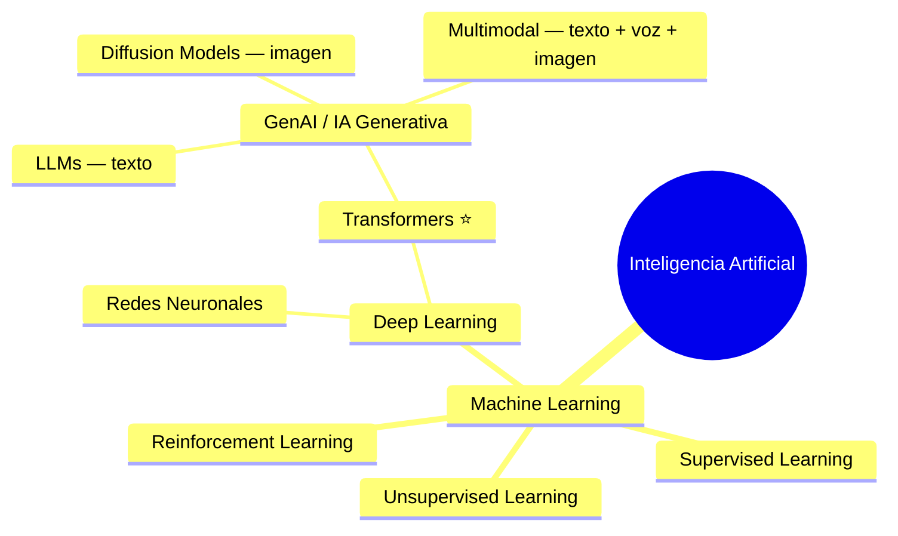
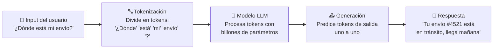
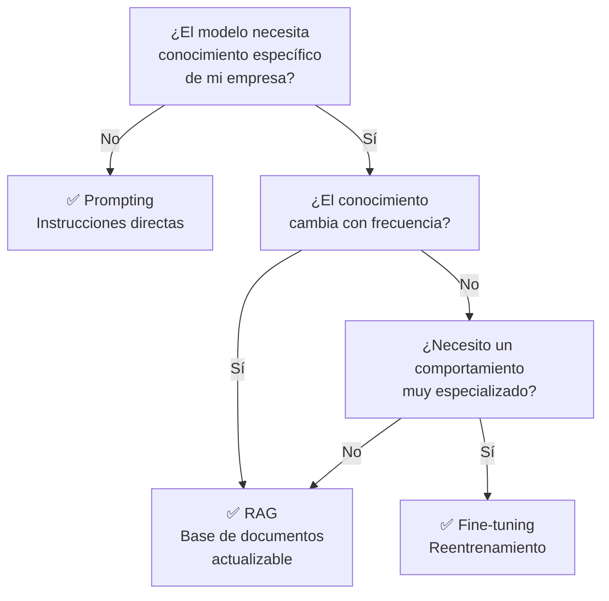

# Fundamentos de IA y LLMs

Guía ejecutiva para entender la tecnología detrás de [HappyRobot](../empresa/producto.md) y mantener una conversación informada en entrevista. Lectura: ~20 min.

---

## 1. ¿Qué es la IA hoy?

### El mapa mental

**Inteligencia Artificial** es el paraguas: cualquier sistema que imita capacidades cognitivas humanas. Dentro de AI, **Machine Learning** es la familia de técnicas donde la máquina aprende de datos en lugar de seguir reglas escritas a mano — piensa en la diferencia entre un manual de RRHH (reglas) y un empleado senior que ha visto 10.000 casos (ML).

**Deep Learning** usa redes neuronales con muchas capas para encontrar patrones complejos. Funcionó bien durante años para tareas específicas (reconocer caras, traducir frases), pero el salto de 2023-2026 viene de una arquitectura concreta: los **Transformers**.

### Por qué 2023-2026 es diferente

En 2017, Google publicó el paper *"Attention is All You Need"*, que introdujo los Transformers. La idea clave: el modelo puede "prestar atención" a todas las partes de un texto a la vez, en lugar de leerlo palabra por palabra. Esto permitió entrenar modelos enormes de forma eficiente.

Después llegaron las **scaling laws**: se descubrió que si multiplicas los datos de entrenamiento y el tamaño del modelo, la calidad mejora de forma predecible. Eso desató una carrera de inversión sin precedentes — OpenAI, Google, Anthropic, Meta, Mistral — porque el camino estaba claro: más datos + más computación = mejor modelo. Desde ~2024, el scaling puro de entrenamiento ha mostrado rendimientos decrecientes, y la industria ha virado hacia optimizar también el **test-time compute** (hacer que el modelo "piense más" en cada respuesta, en lugar de solo entrenar modelos más grandes). Técnicas como chain-of-thought extendido y "reasoning models" son el resultado de este cambio de paradigma.

El resultado es la **IA Generativa**: modelos que no solo clasifican o predicen, sino que *crean* texto, código, imágenes, audio. Es la base de los [AI Workers de HappyRobot](../empresa/producto.md): agentes que mantienen conversaciones telefónicas reales, redactan emails y toman decisiones operativas.

---

## 2. Large Language Models (LLMs)

Un LLM es, en esencia, una máquina de **predecir la siguiente palabra**. Ha leído billones de textos (libros, webs, código, conversaciones) y ha aprendido patrones estadísticos sobre cómo se encadenan las palabras. Cuando le das un input, genera la respuesta token a token, eligiendo en cada paso la continuación más probable (o más creativa, según la configuración).

### Cómo funciona (simplificado)

### Conceptos que DEBES conocer

#### Tokens — Las "unidades de facturación"

Un token es un fragmento de texto (~¾ de una palabra en español). Los LLMs cobran por tokens procesados, igual que una operadora cobra por minutos. Cuando HappyRobot gestiona una llamada de atención al cliente, el coste de inferencia se mide en tokens consumidos (input + output).

**Regla de bolsillo:** 1.000 tokens ≈ 750 palabras en español.

#### Context window — La "memoria de trabajo"

Es la cantidad máxima de texto que el modelo puede "ver" de una vez. Piensa en ello como el tamaño del escritorio: cuantos más documentos caben, más contexto tiene para responder bien.

| Modelo | Context window | Equivalente aproximado |
|--------|---------------|----------------------|
| GPT-5.4 | 272K estándar, 1M vía API | ~400-1.500 páginas |
| Claude Opus/Sonnet 4.6 | 1M tokens | ~1.500 páginas |
| Gemini 3.1 Pro | 1M tokens | ~1.500 páginas |
| Llama 4 Scout | 10M tokens | ~15.000 páginas |
| Llama 4 Maverick | 1M tokens | ~1.500 páginas |

Para HappyRobot esto importa mucho: un AI Worker que gestiona reclamaciones de envío necesita "recordar" el historial del cliente, las políticas de la empresa y el contexto de la conversación — todo eso consume context window.

#### Temperature — El "dial de creatividad"

Controla lo predecible vs. creativo que es el modelo. Temperature 0 = siempre la respuesta más probable (ideal para datos y operaciones). Temperature alta = más variación y creatividad (útil para brainstorming, no para logística).

HappyRobot usa temperatures bajas en sus AI Workers porque en operaciones enterprise quieres consistencia, no sorpresas.

#### Prompting — Las "instrucciones al modelo"

El prompt es el texto que le das al modelo para guiar su comportamiento. Un buen prompt es como un buen brief a una agencia: cuanto más claro y específico, mejor el resultado. Incluye:

- **System prompt:** Las instrucciones base ("Eres un agente de atención al cliente de DHL...")
- **Few-shot examples:** Ejemplos de conversaciones correctas para que el modelo imite el patrón
- **Guardrails:** Restricciones ("Nunca des información de precios", "Si no sabes, transfiere a un humano")

Los [AI Workers de HappyRobot](../empresa/producto.md) combinan prompting avanzado con lógica determinista — el LLM maneja la conversación natural, pero las reglas de negocio están hardcodeadas para garantizar compliance.

### Landscape de modelos

| Modelo | Proveedor | Tipo | Lo que debes saber |
|--------|-----------|------|-------------------|
| **GPT-5.4 (Pro/Mini/Nano)** | OpenAI | Cerrado | El flagship actual. Pro para razonamiento complejo, Mini y Nano para volumen. 272K-1M contexto |
| **Claude Opus / Sonnet 4.6** | Anthropic | Cerrado | 1M de contexto nativo. Opus para tareas complejas, Sonnet equilibra calidad/coste |
| **Gemini 3.1 Pro / 3 Flash** | Google | Cerrado | 1M contexto. Flash es 3x más rápido y muy competitivo en precio |
| **Llama 4 (Scout / Maverick)** | Meta | Abierto (Apache 2.0) | Scout tiene 10M de contexto. Gratis, personalizable, ideal para data sovereignty |
| **Mistral Large 3 / Small 4** | Mistral | Mixto | Large 3 es cerrado vía API. Small 4 es abierto (Apache 2.0). Fuertes en Europa |

!!! tip "Para la entrevista"
    HappyRobot es **model-agnostic**: usa el mejor modelo para cada caso. Han trabajado con GPT-5.4, Llama, Mistral y otros. Esto es un diferenciador clave frente a competidores que dependen de un solo proveedor — si OpenAI sube precios o tiene una caída, HappyRobot puede pivotar.

---

## 3. RAG vs Fine-tuning vs Prompting

Tres formas de hacer que un LLM "sepa" cosas específicas de tu negocio. HappyRobot usa las tres según el caso.

| Técnica | Analogía | Qué es | Cuándo se usa | Coste / Esfuerzo |
|---------|----------|--------|---------------|------------------|
| **Prompting** | Darle instrucciones a un becario listo | Escribes las reglas en el prompt. El modelo las sigue sin necesidad de entrenamiento. | Reglas simples, cambios frecuentes. "Si el cliente pide un reembolso > 500€, transfiere a supervisor." | Bajo |
| **RAG** | Darle un manual de referencia | El modelo busca en una base de datos de documentos y usa lo que encuentra para responder. | Conocimiento que cambia a menudo (catálogos, políticas, FAQs). El modelo "consulta" antes de responder. | Medio |
| **Fine-tuning** | Formar a un especialista | Reentrenar el modelo con datos propios para que interiorice conocimiento o estilo. | Cuando necesitas un tono muy específico o conocimiento profundo de dominio. | Alto |

!!! example "Ejemplo HappyRobot"
    Un AI Worker de [collections](../casos-de-uso/collections.md) para una empresa de logística podría usar: **prompting** para las reglas de negociación ("ofrece plan de pagos si la deuda > 90 días"), **RAG** para consultar el historial de facturas del cliente en tiempo real, y **fine-tuning** para que el tono de voz suene como el equipo de cobros de esa empresa específica.

---

## 4. Costes de inferencia

### Cómo se factura un LLM

Los proveedores cobran por millón de tokens procesados, diferenciando entre input (lo que envías) y output (lo que genera). Los precios han caído ~10x desde 2023 y siguen bajando.

| Modelo | Input (por 1M tokens) | Output (por 1M tokens) |
|--------|-----------------------|------------------------|
| GPT-5.4 | ~$2.50 | ~$15.00 |
| GPT-5.4 Mini | ~$0.75 | ~$4.50 |
| GPT-5.4 Nano | ~$0.20 | ~$1.25 |
| Claude Sonnet 4.6 | ~$3.00 | ~$15.00 |
| Claude Opus 4.6 | ~$5.00 | ~$25.00 |
| Gemini 3 Flash | ~$0.50 | ~$3.00 |
| Mistral Small 4 | ~$0.15 | ~$0.60 |
| Llama 4 (self-hosted) | Gratis | Gratis |

### ¿Cuánto cuesta una llamada de atención al cliente?

Una llamada telefónica típica de 5 minutos gestionada por un AI Worker consume ~2.000-4.000 tokens. Con un modelo mid-tier como GPT-5.4 Mini o Nano, eso sale a **$0.01-$0.03 por llamada** en coste de LLM puro (los precios han caído significativamente desde 2024).

Compara con un agente humano en España (~25€/hora): una llamada de 5 min cuesta ~2€ en salario. El AI Worker es **40-100x más barato** solo en coste de inferencia, sin contar disponibilidad 24/7 y escalabilidad instantánea.

!!! warning "Coste total ≠ coste de inferencia"
    El coste real de un AI Worker incluye: inferencia LLM + telefonía/VoIP + infraestructura cloud + desarrollo y mantenimiento + soporte de forward-deployed engineers. La inferencia es solo una parte, pero la tendencia de precios a la baja hace que el business case mejore cada trimestre.

### Por qué importa para el GTM en España

El argumento de venta no es "es más barato" (aunque lo es). Es que el AI Worker **escala sin fricción**: gestionar 100 o 10.000 llamadas simultáneas tiene el mismo coste marginal por llamada. Para una empresa logística española con picos estacionales (Black Friday, Navidad, rebajas), eso elimina la pesadilla de contratar y formar temporales.

---

## 5. Open source vs Closed source

| Dimensión | Closed source (GPT-5.4, Claude) | Open source (Llama, Mistral) |
|-----------|-------------------------------|------------------------------|
| **Control** | Dependes del proveedor. Si cambian el modelo, te afecta. | Puedes fijar una versión y modificarla. |
| **Coste** | Pagas por token (variable). Predecible pero puede escalar. | Pagas infraestructura (fijo). Más barato a escala. |
| **Soberanía de datos** | Tus datos pasan por servidores del proveedor. | Puedes ejecutar el modelo en tu propia infraestructura o en cloud europeo. |
| **Calidad** | Generalmente superior en los modelos top. | Cada vez más cerca. Llama 4 compite con GPT-5.4 en muchas tareas. |
| **Velocidad de mejora** | El proveedor mejora el modelo por ti. | Tienes que actualizar y gestionar tú. |

### Implicaciones para HappyRobot y la venta enterprise en Europa

Ser **model-agnostic** es una ventaja competitiva enorme en Europa, y especialmente en España. Razones:

1. **GDPR y EU AI Act** — Muchas empresas europeas exigen que los datos no salgan de la UE. Con modelos open source desplegados en cloud europeo, HappyRobot puede garantizarlo. Ver [regulación](../regulacion/eu-ai-act.md).

2. **Negociación de precios** — Si un proveedor sube tarifas, HappyRobot puede migrar a otro modelo. Eso protege los márgenes y da estabilidad de precios al cliente.

3. **Personalización profunda** — Con modelos open source puedes hacer fine-tuning que con closed source no siempre es posible (o es mucho más caro).

!!! tip "Talking point para la entrevista"
    *"La estrategia model-agnostic de HappyRobot convierte lo que para otros es un riesgo de proveedor en una ventaja competitiva. En el mercado europeo, donde la soberanía de datos es un deal-breaker, poder desplegar modelos open source en infraestructura EU es un argumento de venta diferencial."*

---

## Resumen flash — Cheat sheet

| Concepto | En una frase |
|----------|-------------|
| **LLM** | Motor de texto que predice la siguiente palabra, entrenado con internet entera. |
| **Token** | Unidad de facturación (~¾ de palabra). Cobran por millón. |
| **Context window** | Cuánto texto "recuerda" el modelo de una vez. Más = mejor, pero más caro. |
| **Temperature** | Dial creatividad: bajo = consistente, alto = sorpresivo. Enterprise usa bajo. |
| **Prompting** | Instrucciones al modelo. Barato, flexible, limitado en conocimiento profundo. |
| **RAG** | El modelo consulta documentos externos antes de responder. Conocimiento actualizable. |
| **Fine-tuning** | Reentrenar el modelo con datos propios. Caro pero potente. |
| **Model-agnostic** | No depender de un solo proveedor. Ventaja clave de HappyRobot. |
| **Open vs Closed** | Open = control y soberanía. Closed = calidad top y menos gestión. |
| **Coste inferencia** | ~$0.01-0.03 por llamada con modelos mid-tier. 40-100x más barato que agente humano. Baja cada trimestre. |
