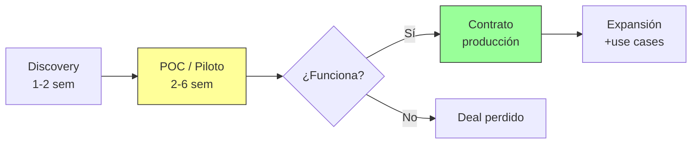

# IA en Enterprise — Cómo se vende y se compra

Lo que necesitas saber sobre vender AI enterprise viniendo del lado comprador. Lectura ~10 min.

---

## 1. El ciclo de venta de AI enterprise

En SaaS tradicional vendes licencias: demo, propuesta, cierre. En AI enterprise hay una fase intermedia que lo cambia todo: **el piloto**. El comprador no confía en promesas — quiere ver resultados con *sus* datos, *sus* procesos, *su* caos operativo.

**Implicaciones clave:**

- **El piloto es la venta.** No el pitch, no la demo. Si el piloto funciona, el contrato es casi automático. Si falla, no hay retórica que lo salve.
- **HappyRobot convierte 95%+ de pilotos en contratos** [A: HR-UPSTARTS]. Esto es excepcional — la media del sector está en 30-50% [B: estimación sector]. La razón: [forward-deployed engineers](../tecnologia/forward-deployed.md) que garantizan que el piloto funcione.
- **Ciclo largo.** Discovery a producción: 2-4 meses mínimo. Enterprise grande (DHL): 6-12 meses.
- **Multi-stakeholder.** VP Ops quiere eficiencia, CFO quiere ROI, IT quiere seguridad, Legal quiere compliance. Hay que hablar el idioma de cada uno.
- **Land and expand.** Entras con un use case (ej: scheduling), demuestras valor, y expandes a collections, customer service, etc. Circle Logistics empezó con carrier operations y hoy usa HappyRobot across múltiples funciones.

---

## 2. Objeciones típicas y cómo responderlas

Estas son las 6 objeciones que vas a escuchar en *cada* conversación con enterprise:

| Objeción | Lo que realmente preocupa | Respuesta HappyRobot |
|----------|--------------------------|----------------------|
| **"¿Y si alucina?"** | Miedo a que la IA diga algo incorrecto a un cliente | Arquitectura híbrida: razonamiento agéntico + **guardrails deterministas**. AI Auditor revisa cada interacción. El sistema *no puede* salirse de las reglas de negocio definidas |
| **"No tenemos los datos limpios"** | Creen que necesitan un proyecto de data de 6 meses antes | HappyRobot se integra con los sistemas existentes (TMS, ERP, CRM) *tal como están*. Los FDEs manejan la complejidad de integración |
| **"¿Qué pasa con mis empleados?"** | Miedo a despidos, resistencia del equipo | **Augmentation, no replacement.** Los AI Workers manejan las tareas repetitivas; los humanos se enfocan en lo complejo y relacional. Ejemplo real: en Circle Logistics, el equipo pasó de perseguir carriers por teléfono a gestionar excepciones estratégicas |
| **"Compliance / regulación"** | GDPR, EU AI Act, datos sensibles | SOC 2 Type II, GDPR compliant, HIPAA ready, EU AI Act ready. Cloud y model-agnostic — los datos pueden quedarse en la nube del cliente |
| **"¿Cuánto cuesta realmente?"** | No quieren un money pit sin ROI claro | Framing en ROI, no en coste. Collections: **119x ROI** [A: HR-SERIEB]. Carrier ops: **5x ROI** [A: HR-SERIEB]. El piloto tiene coste controlado; pagas producción solo cuando ves resultados |
| **"Ya probamos AI y no funcionó"** | Trauma de chatbots malos o proyectos fallidos | Por eso existen los FDEs. No es "aquí tienes el software, suerte". Es un equipo de ingenieros embebido en tus operaciones hasta que funcione. 95%+ conversion rate de pilotos lo demuestra [A: HR-UPSTARTS] |

**Tip para la entrevista:** Tu experiencia en Amazon lanzando categorías desde cero es directamente aplicable. Cuando lanzaste Apparel, tuviste que convencer a 75+ marcas de confiar en un canal nuevo. Vender AI es lo mismo: gestionar incertidumbre del comprador con datos y pruebas piloto.

---

## 3. Modelos de pricing en AI

| Modelo | Cómo funciona | Quién lo usa | Pros/Contras |
|--------|---------------|--------------|--------------|
| **Per-seat** | Precio por usuario/agente | Salesforce Einstein, Microsoft Copilot | Predecible pero no escala con valor |
| **Per-minute / per-call** | Cobro por uso de voz/conversación | Bland AI, Synthflow, Retell (dev tier) | Transparente pero impredecible para el comprador |
| **Per-outcome** | Cobro por resultado (cobro recuperado, cita agendada) | Modelos emergentes | Alinea incentivos pero difícil de definir outcomes |
| **Platform fee + usage** | Fee base mensual + variable por volumen | **HappyRobot** (enterprise) | Ingresos recurrentes + upside por adopción |

**HappyRobot:** Contratos enterprise custom. No publica precios. Para developer tier hay pricing per-minute, pero el negocio real son los contratos enterprise con platform fee + variable por uso. Los FDEs se incluyen en el coste de deployment, no se facturan aparte.

**Lo que importa saber:** El pricing de AI enterprise se negocia deal-by-deal. El arte está en anclar la conversación en el **valor entregado** (dinero recuperado, horas ahorradas, errores eliminados), no en el coste del software.

---

## 4. El modelo forward-deployed

Esto es lo más importante que debes entender del GTM de HappyRobot. Lee [el nodo completo](../tecnologia/forward-deployed.md), pero aquí va el resumen ejecutivo:

**Qué es:** Ingenieros de HappyRobot trabajan *dentro* del equipo del cliente durante semanas o meses. No es soporte técnico — es co-construcción.

**Por qué funciona:**

1. **Elimina el "implementation gap"** — La razón #1 por la que AI enterprise falla es la distancia entre lo que el vendor promete y lo que realmente se despliega. Los FDEs eliminan esa distancia.
2. **Convierte pilotos en contratos** — 95%+ conversion [A: HR-UPSTARTS] porque el piloto está engineered para funcionar.
3. **Genera expansión orgánica** — Un FDE dentro del cliente ve otros problemas que HappyRobot puede resolver. Es el mejor lead gen que existe.
4. **Barrera competitiva brutal** — Ningún competidor en voice AI ofrece FDEs. Bland, Synthflow, Retell son self-service. Una vez que HappyRobot está embebido, es casi imposible desplazarlo.

**Modelo inspirado en Palantir**, que lo usó para pasar de $0 a $3B+ en revenue. HappyRobot lo aplica al mercado de AI agents.

**Implicación para España:** Como GM, tu rol incluye construir el equipo de FDEs en Europa. Ya están contratando Forward Deployed Engineer (Europe). Esto no es solo ventas — es una operación de delivery.

---

## 5. Métricas que importan al comprador

Cuando hablas con un VP Ops o un CFO, no les importa qué modelo de lenguaje usas. Les importa esto:

| Métrica | Qué mide | Ejemplo HappyRobot |
|---------|----------|---------------------|
| **Automation rate** | % de interacciones resueltas sin humano | 50%+ handled autonomously |
| **Cost per resolution** | Coste de resolver un caso (AI vs humano) | 10x reducción en coste por cobro |
| **Time to resolution** | Cuánto tarda en resolverse | De minutos/horas a segundos. 1000x más rápido en scheduling |
| **Error rate** | Precisión vs proceso manual | AI Auditor + guardrails deterministas |
| **ROI** | Return on investment total | 119x en collections [A: HR-SERIEB], 5x en carrier ops [A: HR-SERIEB] |
| **Response rate / FRT** | Disponibilidad | 100% response rate, 0 min first response time |

**Cómo usar esto en conversación de venta:**

> "Hoy tienes 20 personas haciendo llamadas de cobro. Recuperan X al mes y te cuestan Y. Con un AI Worker, en el piloto vamos a demostrar que recuperamos un 18% más con un coste 10x menor. Si funciona, escalamos. Si no, no pagas."

Eso es lo que convence a un CFO. No "tenemos un LLM con reasoning capabilities."

---

## Resumen: lo que llevas a la entrevista

1. **AI enterprise se vende demostrando, no prometiendo.** El piloto es la venta.
2. **Las objeciones son siempre las mismas.** Alucinaciones, datos, empleados, compliance, coste, trauma previo. Tienes respuesta para todas.
3. **HappyRobot gana por los FDEs**, no solo por la tecnología. Es un modelo de delivery, no solo de software.
4. **Habla en métricas de negocio**, no en tecnología. ROI, automation rate, cost per resolution.
5. **Tu experiencia es más relevante de lo que crees.** Amazon (convencer marcas de un canal nuevo) y Uber (escalar operaciones en mercados nuevos) son exactamente las habilidades que necesita este rol.
