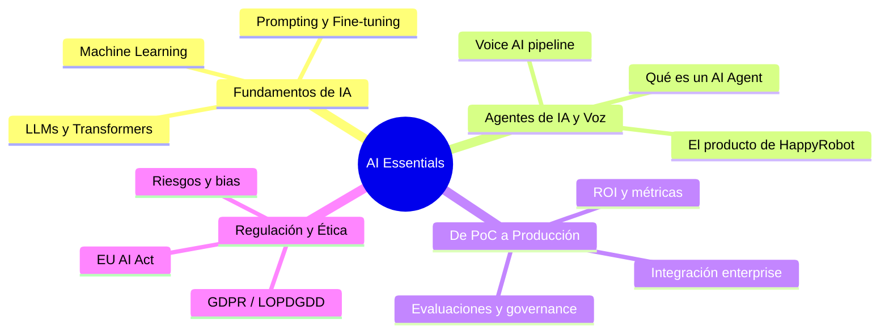

# AI Essentials — Crash Course

Lola viene de liderar operaciones en Amazon y Uber, no de un background técnico en IA. Esta sección cubre **lo justo** para que entre a la entrevista con confianza: entender de qué habla HappyRobot, por qué importa, y poder opinar con criterio.

**Tiempo estimado:** ~60 min de lectura (4 módulos) + glosario como referencia.

---

## Mapa de contenidos

## Módulos

| # | Módulo | Tiempo | Descripción |
|---|--------|--------|-------------|
| 1 | [Fundamentos y LLMs](fundamentos-y-llms.md) | ~20 min | De machine learning a LLMs: lo esencial sin código |
| 2 | [Agentes y Voz](agentes-y-voz.md) | ~20 min | Qué son los AI agents, cómo funciona voice AI, y cómo encaja HappyRobot |
| 3 | [IA en Enterprise](ia-en-enterprise.md) | ~10 min | Ciclo de venta AI, objeciones, pricing, forward-deployed |
| 4 | [Riesgos y Governance](riesgos-y-governance.md) | ~10 min | Alucinaciones, seguridad, EU AI Act, GDPR — lo que un GM debe saber |
| -- | [Glosario](glosario.md) | Referencia | Términos técnicos explicados en una frase, para consultar antes o durante la entrevista |

## Por dónde empezar

!!! tip "Si tienes poco tiempo"
    Lee los módulos en orden (1 → 4), pero si solo tienes 20 minutos, ve directo a **[Agentes de IA y Voz](agentes-y-voz.md)** — es el core del producto de HappyRobot y lo que más probabilidad tiene de salir en la conversación con Aquilino. Complementa con el **[Glosario](glosario.md)** para tener el vocabulario fresco.
